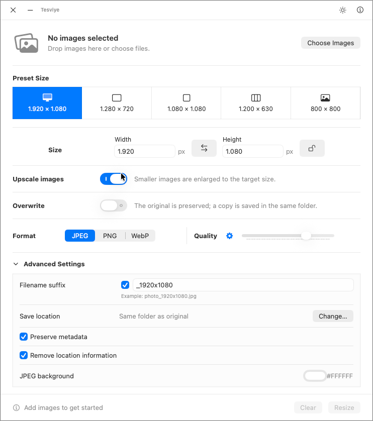

# Tesviye


Tesviye is a focused, native macOS utility for resizing one or many images. It combines precise pixel sizing,
useful presets, format conversion, quality control, safe output naming, and a Finder Quick Action in one compact
workflow.

[Website](https://tercan.github.io/tesviye/) · [Türkçe tanıtım](https://tercan.github.io/tesviye/tr/) ·
[Version 1.2.1](https://github.com/tercan/tesviye/tree/v1.2.1)

## Download and install

**[Download Tesviye 1.2.1 for macOS (Tesviye-1.2.1-universal.dmg, 6 MB)](https://tercan.github.io/tesviye/downloads/Tesviye-1.2.1-universal.dmg)**

macOS 14 or later is required. The universal app supports Apple Silicon and Intel Macs.

1. Quit any older running copy of Tesviye.
2. Open the DMG and drag **Tesviye.app** to **Applications**.
3. Eject the disk image and open Tesviye from Applications.

This package is **ad-hoc signed and not notarized by Apple**. macOS may block its first launch.
Only if you trust the download, follow [Apple’s opening guidance](https://support.apple.com/en-us/102445)
for an application-specific approval. The package does not require disabling Gatekeeper globally.

[GitHub Release and assets](https://github.com/tercan/tesviye/releases/tag/v1.2.1) ·
[SHA-256 checksums](https://tercan.github.io/tesviye/downloads/Tesviye-1.2.1-universal.dmg.sha256) ·
[Matching v1.2.1 source archive](https://github.com/tercan/tesviye/archive/refs/tags/v1.2.1.zip)

To verify a downloaded copy, place `Tesviye-1.2.1-universal.dmg.sha256` beside the DMG and run:

```bash
shasum -a 256 -c Tesviye-1.2.1-universal.dmg.sha256
```

## Screenshots

<picture>
  <source media="(prefers-color-scheme: dark)" srcset="docs/assets/tesviye-image-resizer-screenshot-dark.png">
  <source media="(prefers-color-scheme: light)" srcset="docs/assets/tesviye-image-resizer-screenshot-light.png">
  
</picture>

## Features

- Resize a single image or process multiple selected images as a batch.
- Keep each image’s original dimensions for format-only conversion, choose one of five built-in sizes, or enable Custom Size to enter width and height.
- Preserve the aspect ratio, swap width and height, and optionally prevent upscaling.
- Export to JPEG, PNG, or WebP, with or without resizing.
- Use automatic quality by default or enable manual quality control for JPEG and WebP.
- Preserve originals, overwrite intentionally, or save copies to a custom output folder.
- Optionally add a filename suffix and resolve collisions with `-1`, `-2`, and subsequent numbers.
- Preserve image metadata while optionally removing location metadata.
- Choose a JPEG background color when a transparent source must be flattened.
- Start from Finder through the **Resize Images** Quick Action.
- Remember the most recent size mode, output folder, suffix, and light or dark appearance.
- Choose a saved light or dark theme with one appearance toggle.
- Review per-file results and clear the selected image list in one action.

## Build requirements

- macOS 14 or later
- Xcode with the macOS SDK; the current local validation uses Xcode 27
- An Apple development team selected in Xcode when running a signed local build

## Build from source

1. Clone the repository:

   ```bash
   git clone https://github.com/tercan/tesviye.git
   cd tesviye
   ```

2. Open `tesviye.xcodeproj` in Xcode.
3. Select the **tesviye** scheme and choose your development team under **Signing & Capabilities**.
4. Build and run the current scheme.

Xcode resolves the pinned `libwebp-Xcode` Swift Package dependency automatically.

The custom title bar supports dragging and minimizing. Closing the app exits completely; an active batch is stopped safely before termination.

## Usage

1. Select one or more images with **Select Images**, drag them onto the application window, or invoke the Finder
   Quick Action.
2. Choose **Keep Size** for format-only conversion, a preset size, or **Custom Size** to enable width and height inputs.
3. Set upscaling, overwrite behavior, output format, and quality mode.
4. Adjust the always-visible filename suffix, output folder, metadata options, and JPEG background color as needed.
5. Disable **Use filename suffix** to retain the original basename; existing filenames still receive a safe numbered suffix.
6. Select **Convert**, review the completion summary, and use **Show Images in Finder** to reveal the generated files.

By default, Tesviye keeps the original file and writes the resized copy next to it. If a file with the same name
already exists, the application chooses the next available numbered name instead of replacing it silently.

## Finder Quick Action

The `TesviyeFinderAction` extension is embedded in the application bundle and accepts up to 100 images per Finder
request. After building or installing Tesviye:

1. Select one or more image files in Finder.
2. Open the context menu and choose **Quick Actions → Resize Images**.
3. Tesviye opens a single window with all selected images loaded.

If the action is hidden, review the macOS extension controls under **System Settings → General → Login Items &
Extensions** and enable the Tesviye action.

## Privacy and resource use

Tesviye processes images locally. It does not upload images, require an account, include an analytics SDK, or run a
background service after the application exits. The only website link in the app opens the public Tesviye project
page when the user selects it.

## Localization

The application and Finder Quick Action include English and Turkish localizations. New user-facing strings must be
added to both localization files:

- `en.lproj/Localizable.strings`
- `tr.lproj/Localizable.strings`
- `FinderAction/en.lproj/InfoPlist.strings`
- `FinderAction/tr.lproj/InfoPlist.strings`

## Tests

Run the unit and integration suite without code signing:

```bash
xcodebuild \
  -project tesviye.xcodeproj \
  -scheme tesviye \
  -destination 'platform=macOS' \
  -derivedDataPath /tmp/TesviyeDerivedData \
  CODE_SIGNING_ALLOWED=NO \
  test
```

Create an unsigned Release build:

```bash
xcodebuild \
  -project tesviye.xcodeproj \
  -scheme tesviye \
  -configuration Release \
  -destination 'platform=macOS' \
  -derivedDataPath /tmp/TesviyeDerivedData-Release \
  CODE_SIGNING_ALLOWED=NO \
  build
```

## Project structure

- `ContentView.swift` — main SwiftUI interface and native macOS window integration
- `MainViewModel.swift` — selection, progress, state, and batch workflow coordination
- `ImageResizeService.swift` — image decoding, resizing, metadata, encoding, and safe output installation
- `PreferencesStore.swift` — durable user preferences and migration
- `FinderAction/` — Finder Quick Action extension
- `TesviyeTests/` — model, file workflow, extension, asset, and regression tests
- `docs/` — public GitHub Pages website

## License

Tesviye is available under the [GNU General Public License v2.0](LICENSE). WebP support is provided through
`libwebp-Xcode`; see [ThirdPartyNotices.txt](ThirdPartyNotices.txt) for attribution and license information.
